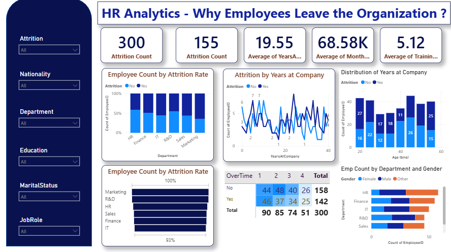

📊 HR Analytics Dashboard – Why Employees Leave the Organization?

This project presents a Power BI HR Analytics Dashboard designed to identify the key factors behind employee attrition. It provides insights across demographics, job roles, departments, and performance indicators to help HR teams make data-driven retention decisions.

🚀 Project Overview

Employee attrition is one of the most critical challenges for modern organizations. This dashboard helps uncover why employees leave, what patterns exist, and where improvements can be made.

The dashboard delivers:

Complete attrition KPIs

Department & job role attrition trends

Age-wise and experience-wise analysis

Overtime behaviour insights

Gender distribution across teams

Employee lifecycle patterns

🖼️ Dashboard Preview

📁 Dataset

The project uses an HR employee dataset containing:

Age, gender, education

Job role, department, salary

Years at company, training score

Overtime, marital status

Attrition (Yes/No)

Your uploaded dataset: hr_employee_data_with_nationality.csv

📌 Key Dashboard Features
🔹 1. Main KPIs

300 – Total Attrition Count

155 – Attrition Rate

19.55 – Avg. Years at Company

68.58K – Avg. Monthly Income

5.12 – Avg. Training Score

🔹 2. Employee Count by Attrition (Yes/No)

Bar charts showing department-wise attrition distribution.

🔹 3. Attrition by Years at Company

Line chart showing employee lifecycle behaviour.

🔹 4. Attrition by Age Group

Identifies high-risk age segments.

🔹 5. Employee Count by Department & Gender

Breakdown of workforce representation.

🔹 6. Overtime vs Attrition Table

Reveals the relationship between overtime and attrition decisions.

🛠️ Tools & Technologies

Power BI – Dashboard creation

Power Query – Data cleaning

DAX – KPIs & calculated measures

Excel / CSV – Dataset handling

🧮 Sample DAX Measures
Attrition Count
Attrition Count = CALCULATE(COUNT(Employee[Attrition]), Employee[Attrition] = "Yes")

Attrition Rate
Attrition Rate = DIVIDE([Attrition Count], COUNTROWS(Employee))

Average Years at Company
Average YearsAtCompany = AVERAGE(Employee[YearsAtCompany])

🧠 Insights

Higher attrition observed in Sales & R&D departments

Overtime employees show greater likelihood of leaving

Younger employees (25–35) represent the highest exits

Employees with lower income levels tend to churn early

Improving training & job satisfaction can improve retention

🎯 Business Impact

This analysis enables organizations to:

Reduce employee turnover

Identify high-risk segments

Plan better hiring strategies

Save recruitment and training costs

Improve employee satisfaction

#PowerBI #HRAnalytics #Dashboard #Attrition #DataAnalysis #DAX
#BusinessIntelligence #Visualization #DataAnalytics #SQL

